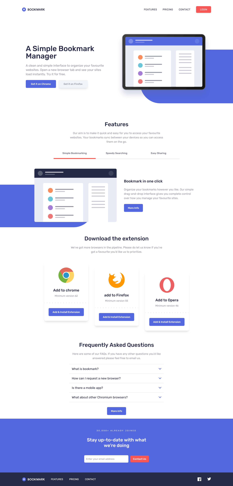

# Frontend Mentor - Todo app

## Welcome! 👋

# Frontend Mentor - Bookmark landing page solution

This is a solution to the [Bookmark landing page challenge on Frontend Mentor](https://www.frontendmentor.io/challenges/bookmark-landing-page-5d0b588a9edda32581d29158).

### Screenshot

### Links

- Live Site URL: [Add live site URL here](https://karimaoulallay.github.io/Bookmark-landing-page/)

## My process

### Built with

- Semantic HTML5 markup
- Flexbox
- CSS Grid
- Mobile-first workflow
- Tailwincss
- Little bit of JavaScript

### What I learned

I learnt on this project Tailwindcss and dealing with npm.

## Author

- Frontend Mentor - (https://www.frontendmentor.io/profile/karimode)
- Twitter - (https://twitter.com/karim_aoulallay)
